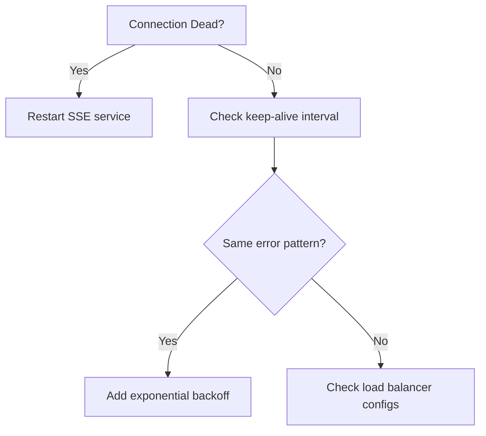
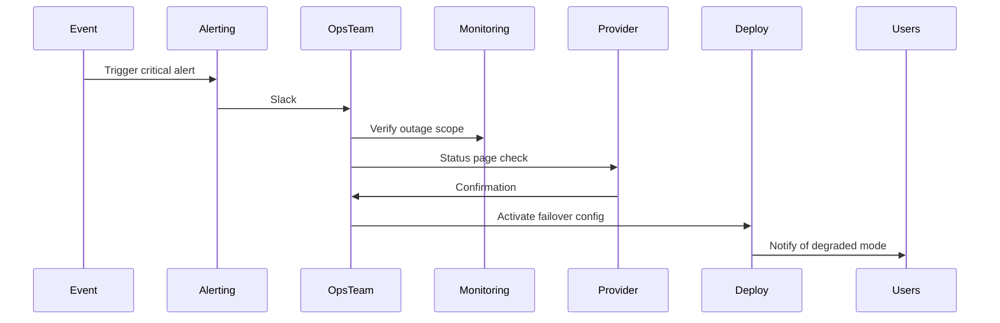

# docs/runtime/Performance-Runbook.md

## ToneCraft Performance Runbook

**Revision:** 0.1 | **Date:** 2026-08-02 | **Owner:** Team

**Production Monitoring Stack**

| Category | Tool |
|----------|------|
| **Logging** | Winston → CloudWatch Logs |
| **Error Monitoring** | Sentry (error grouping, alerts) |
| **Metrics** | Prometheus + Grafana dashboards |
| **Uptime Monitoring** | UptimeRobot (5m checks) |
| **Database Monitoring** | Prisma Studio + pg_stat_statements |
| **AI Provider Monitoring** | CloudWatch Metrics (Latency, Throughput, Errors) |

**Purpose:** Incident response guide for performance degradation events in production.

---

## 1. Investigating Slow AI Responses

### Step 1: Verify Scope

- Check if slow response is isolated to specific:
  - Model endpoints (`/api/v1/generate`)
  - Prompt types (complex vs basic)
  - User tiers (free vs paid)
- **Example:** Use `monitoring traces --session-id` to mark affected requests - see [Monitoring Guide](monitoring)

### Step 2: Diagnose Bottleneck
| Check | Method | Tool |
|-------|--------|------|
| LLM processing time | LLM provider metrics | Cloud console |
| RAG retrieval latency | Query execution logs | PGProfiler |
| Cache hit ratio | Redis stats | `redis-cli monitor` |
| Node.js event loop | CPU profiling | Clinic.js |
| Database queue | DB connection pool | Prisma Studio |

### Step 3: Action Plan
- **Retune parameters**: Adjust temperature/top_p for quality vs speed tradeoff
- **Cache optimization**: Increase cache TTL for high-frequency prompts
- **Rate limiting**: Implement client-side speed caps
- **Provider switching**: Fallback to cheaper provider if latency >500ms x3

---

## 2. SSE Failure Investigation

### Symptoms
- No streaming updates
- Sporadic disconnections
- High reconnect rate

### Diagnostic Steps
1. Network inspection:
    ```bash
    netstat -anp | grep 'EventSource' 
    curl -v http://localhost/api/notifications/stream
    ```
2. Connection monitoring:
    ```typescript
    es.addEventListener('error', (e) => logEvent('sse-error', e))
    ```
3. Server-side check:
    ```bash
    curl -H "X-API-KEY: ${PROXY_API}" /api/health/events
    ```

### Resolution Flow


---

## 3. Database Performance Triage

### Indrowth Signals
- Query times >100ms sustained
- Connection pool saturation warnings
- High CPU during peak hours

### Investigation Protocol
1. Profile slow queries:
    ```sql
    EXPLAIN ANALYZE query_stats WHERE duration > 100;
    ```
2. Check indexes:
    ```bash
    prisma.db.$queryRaw`SELECT * FROM information_schema.indexes 
    WHERE table_name='usage_records' LIMIT 1`
    ```
3. Connection analysis:
    ```bash
    sudo ss -tuln | grep '5432'
    psql -c "SELECT pid, state FROM pg_stat_activity;"
    ```

### Optimization Tiers
- **Tier 1**: Index addition / query rewrite
- **Tier 2**: Connection pool tuning
- **Tier 3**: Schema redesign

---

## 4. Memory Leak Detection

### Detection Signs
- Node.js heap size > 256MB baseline
- GC frequency > 1/min
- Memory growth over 24h monitoring

### Tools
- `node --inspect heap-out-old-v8.log`
- `clinic flame --on-frame --on-cpu`
- Chrome DevTools heap snapshot

### Common Sources
- Uncleaned event listeners
- Global caches without TTL
- Unbounded arrays in store

### Fix Checklist
- [ ] Add memory ceiling checks
- [ ] Implement cache eviction strategy
- [ ] Audit store subscriptions
- [ ] Verify no dangling timers

---

## 5. High Error Rate Response

### Immediate Actions
1. Enable debug logging:
    ```bash
    DEBUG=* node server.js > debug.log 2>&1
    ```
2. Inspect error clusters:
    ```bash
    grep "ERROR" debug.log | sort | uniq -c | sort -nr
    ```
3. Check alerting thresholds:
    ```bash
    # Example: Query your monitoring platform's critical alerts
    monitoring alerts --severity critical --limit 10
    ```

### Triage Framework
| Error Type | Initial Assessment | Escalation |
|-----------|-------------------|------------|
| 5xx Server | Likely provider issue | Provider monitoring |
| 429 Rate Limit | Normal operation | Scale envelope |
| 401 Auth | Session error | Auth service check |
| Validation | Data quality | Schema review |

### Rollback Trigger
- Sustained error rate >5% for 15m
- 3+ crash stacks in memory
- User impact >15%

---

## 6. Provider Outage Response

### Escalation Matrix
| Level | Criteria | Action |
|-------|----------|--------|
| **1** | Partial degradation | Monitor, notify users |
| **2** | 50% endpoint failure | Implement fallback |
| **3** | Complete outage | Emergency fallback mode |

### Fallback Options
- **Provider Switching**: Automated route to secondary vendor when latency >2s x5 
- **Installed Models**: Activate local inference cache
- **Static Content**: Redirect to cached content hub

### Incident Process


---

## 7. Rollback Procedure

### Recovery Time Objective (RTO)
**15 minutes**  
The maximum acceptable time to restore service after a critical failure.

### Recovery Point Objective (RPO)
**5 minutes**  
The maximum acceptable data loss window, ensured by continuous database backups.

### Triggers
- Monitoring alerts exceed critical thresholds
- Memory leaks detected >1GB growth
- 5xx surge on /api/generate

### Execution Steps
1. **Identify Deployment**:
    ```bash
    # List recent stable release tags
    git tag --sort=-version:refname | head -5
    ```
2. **Revert**:
    ```bash
    # Option A: Revert the problematic commit
    git revert <commit-hash> --no-edit

    # Option B: Roll back to a known stable tag
    git checkout v1.0.0-beta

    # Option C: Use your deployment platform's rollback feature
    # e.g., Vercel: vercel rollback <deployment-id>
    ```
3. **Validate**:
    ```bash
    npm run build && npm run lint && npx tsc --noEmit
    ```
4. **Monitor**:
    - 10m of stable metrics
    - No new error patterns

### Post-Mortem
- Document root cause
- Update monitoring thresholds
- Review risk assessment
- Schedule fix implementation

---

## 8. Observation Checklist

### Daily Review
- [ ] Metric drift detection
- [ ] Error rate spikes
- [ ] Latency trend analysis
- [ ] Secure header compliance

### Weekly Audit
- [ ] Provider SLA verification
- [ ] Cache invalidation effectiveness
- [ ] Memory profile summary
- [ ] Security header audit
- [ ] Cross-service latency correlation

---  

## Cross-References
- [Performance Dashboard](performance-dashboard.md)
- [Product Readiness Report](../reports/product-readiness-report.md)
- [Backup & Restore](../runbooks/backup-restore.md)
- [Security Audit Checklist](../audits/06-security.md)

*The runbook is maintained by Kilo team. Always verify with current monitoring dashboards before executing actions.*